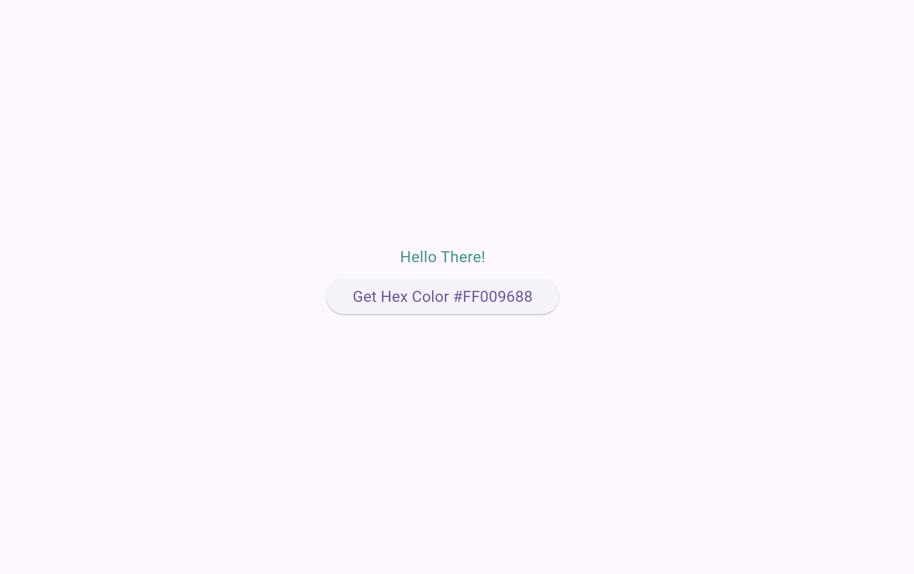

<p align="center">

<a href="https://opensource.org/licenses/BSD-3-Clause"></a>
<a href="https://pub.dev/packages/hexcolor"></a>

</p>

# hexcolor_example

hex color plugin allows you to add hex color codes to your flutter projects

## Getting Started

sample usage

```dart
import 'package:hexcolor/hexcolor.dart';
  Text("Hello There!", style: TextStyle(color: HexColor("#009688"))),
        ElevatedButton(
          onPressed: () {
            setState(() {
              colorCode = Colors.teal.toHex();
            });
          },
          child: Text('Get Hex Color $colorCode'),
        ),
```

```
HexColor("#yourhex")
```

<p> 
 </p>


[](https://www.buymeacoffee.com/ggriffo)
